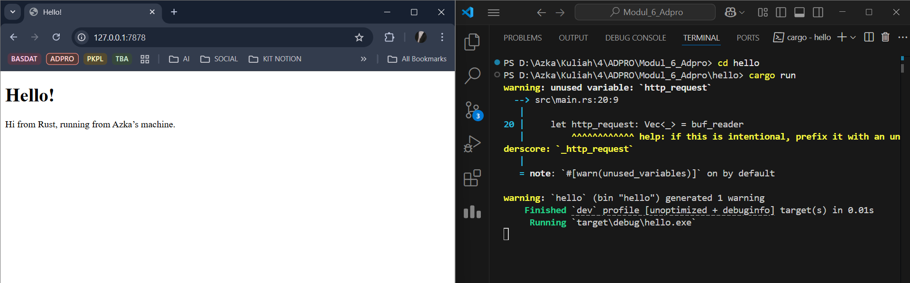

**Tutorial 6 Pemrograman Lanjut (Advanced Programming) 2024/2025 Genap**
* Nama    : Muhammad Almerazka Yocendra
* NPM     : 2306241745
* Kelas   : Pemrograman Lanjut - A

<details>
    <summary><strong> Basic Knowledge 💡 </strong></summary> 
    
Web server adalah program yang menerima permintaan (_request_) dari client (_browser_) dan mengirimkan respon (_response_) sesuai permintaan tersebut.

Sebuah web server biasanya menggunakan dua protokol utama untuk berkomunikasi dengan browser :

**1. TCP (Transmission Control Protocol)**

> **TCP** adalah protokol dasar yang menangani bagaimana data dikirim antara dua komputer. **TCP** memastikan data yang sampai dalam urutan yang benar dan tidak ada yang hilang. Bisa dibilang **TCP** seperti pengantar paket yang memastikan barang sampai ke tujuan tanpa rusak.

**2. HTTP (Hypertext Transfer Protocol)**

> Sedangkan **HTTP** berjalan di atas **TCP** dan menentukan format permintaan dan balasan antara browser dan server. Browser menggunakan HTTP untuk meminta halaman web, sementara server membalas dengan data yang sesuai.

Jadi kesimpulannya **TCP** berfokus pada bagaimana data dikirim sedangkan **HTTP** berfokus pada apa yang dikirim (apa isinya, misal permintaan halaman web).

**Format HTTP Response** :
```css
HTTP-Version Status-Code Reason-Phrase CRLF
headers CRLF
message-body
```
- **HTTP-Version** : Versi protokol HTTP yang digunakan (misalnya, HTTP/1.1).
- **Status-Code** : Angka yang menunjukkan hasil request (200 OK jika sukses).
- **Reason-Phrase** : Penjelasan singkat tentang status _request_.
- **Headers** : Informasi tambahan seperti _Content-Length_, Content-Type__, dll.
- **Message-Body** : Isi dari halaman HTML yang dikirim ke browser.
</details>

### Milestone 1: Single-Threaded Web Server
---
**1. Membuat Server yang Mendengarkan Koneksi TCP**

Hal pertama yang kita lakukan adalah _Server_ perlu mendengarkan koneksi yang masuk agar bisa menerima permintaan dari _browser_. Disini kita menggunakan `TcpListener` untuk menangani masalah ini

```rust
TcpListener::bind("127.0.0.1:7878")
```
  - Membuat server yang mendengarkan koneksi di alamat `127.0.0.1` pada port `7878`.
  - `unwrap()` digunakan agar program langsung berhenti jika terjadi error saat memulai server.

```rust   
for stream in listener.incoming()
```
  - Menerima dan menangani koneksi dari client.
  - `incoming()` mengembalikan iterator yang menghasilkan `TcpStream` setiap kali ada koneksi masuk.

```rust
let stream = stream.unwrap();
```    
  - Mengambil data dari koneksi.
  - `unwrap()` memastikan kita mendapatkan koneksi yang valid.
    
```rust
println!("Connection established!");
```     
  - Mencetak pesan di terminal setiap kali ada koneksi baru.


**2. Memproses dan Membaca _Request_ dari _Browser_**

Fungsi `handle_connection(stream);` digunakan untuk memproses isi dari koneksi yang masuk. Tanpa fungsi ini, server hanya mendeteksi bahwa ada koneksi masuk, tetapi tidak memahami isi permintaan **HTTP** yang dikirim oleh browser. 

Seperti sebelumnya, server hanya mencetak _"Connection established!"_ tanpa mengetahui apa yang sebenarnya diminta oleh klien. Dengan `handle_connection()`, server dapat membaca detail permintaan, seperti metode **HTTP** _(GET, POST)_, URL yang diminta, serta informasi tambahan seperti jenis browser dan format data yang diinginkan.

```rust
fn handle_connection(mut stream: TcpStream) {
```
  - Fungsi ini menerima **TcpStream** yang berisi data dari koneksi browser, _stream_ disini yaitu koneksi aktif antara _server_ dan _client_
    
```rust
let buf_reader = BufReader::new(&stream);
```
  - Membungkus _stream_ dengan **BufReader** agar kita bisa membaca data per baris dengan lebih mudah

```rust
let http_request: Vec<_> = buf_reader
    .lines()
    .map(|result| result.unwrap())
    .take_while(|line| !line.is_empty())
    .collect();
```
  - `.lines()` : Mengembalikan iterator yang menghasilkan setiap baris dalam input sebagai `Result<String, io::Error>`.
  - `.map(|result| result.unwrap())` : Mengambil teks dari setiap baris atau mengekstrak string dari **Result**      (mengabaikan error).
  - `.take_while(|line| !line.is_empty())` : Menghentikan pembacaan ketika menemukan baris kosong (menandakan akhir header dari permintaan **HTTP**).
  - `.collect()` : Memengumpulkan semua baris hasil pembacaan dari iterator menjadi satu koleksi dalam bentuk `Vec<String>`

```rust
println!("Request: {:#?}", http_request);
```
  - Menampilkan isi permintaan **HTTP** di terminal dalam format yang mudah dibaca.
    
***Output detail request*** :
```rust
Request: [
    "GET / HTTP/1.1",
    "Host: 127.0.0.1:7878",
    "Connection: keep-alive",
    "Cache-Control: max-age=0",
    "sec-ch-ua: \"Chromium\";v=\"134\", \"Not:A-Brand\";v=\"24\", \"Google Chrome\";v=\"134\"",
    "sec-ch-ua-mobile: ?0",
    "sec-ch-ua-platform: \"Windows\"",
    "Upgrade-Insecure-Requests: 1",
    "User-Agent: Mozilla/5.0 (Windows NT 10.0; Win64; x64) AppleWebKit/537.36 (KHTML, like Gecko) Chrome/134.0.0.0 Safari/537.36",
    "Accept: text/html,application/xhtml+xml,application/xml;q=0.9,image/avif,image/webp,image/apng,*/*;q=0.8,application/signed-exchange;v=b3;q=0.7",  
    "Sec-Fetch-Site: none",
    "Sec-Fetch-Mode: navigate",
    "Sec-Fetch-User: ?1",
    "Sec-Fetch-Dest: document",
    "Accept-Encoding: gzip, deflate, br, zstd",
    "Accept-Language: en-GB,en;q=0.9,id-ID;q=0.8,id;q=0.7,en-US;q=0.6",     
]
```

### Milestone 2: Returning HTML
---



Sebelumnya, web server hanya menerima koneksi tetapi tidak mengirimkan respons yang bisa ditampilkan oleh browser. Sekarang, kita akan mengirimkan halaman HTML sebagai respons HTTP yang valid, sehingga browser dapat merendernya dengan benar.

Pada tahap ini, kita akan mengubah fungsi `handle_connection` kembali agar bisa mengirimkan halaman HTML.

**1. Membaca File **HTML** dan Menyiapkan Respons**
```rust
let status_line = "HTTP/1.1 200 OK";
let contents = fs::read_to_string("hello.html").unwrap();
let length = contents.len();
```
Penjelasan
- `status_line`: Menentukan status **HTTP** sebagai 200 OK (berhasil).
- `fs::read_to_string("hello.html")`: Kita menggunakan `fs::read_to_string` karena kita ingin mengirimkan file HTML yakni `hello.html` sebagai bagian dari respons **HTTP**, dimana `fs::read_to_string` akan membaca file tersebut ke dalam string dan kemudian dikirimkan ke browser.
- `length`: Menghitung panjang isi HTML untuk dikirimkan dalam header _Content-Length_.

**2. Membentuk Respons HTTP**
```rust
let response = format!(
    "{status_line}\r\nContent-Length: {length}\r\n\r\n{contents}"
)
```
**Format respon yang dibuat** :
```html
HTTP/1.1 200 OK
Content-Length: <panjang-konten>
\r\n
<konten-HTML>
```
- `status_line`: Menandakan bahwa request berhasil (HTTP/1.1 200 OK).
- `Content-Length`: Memberitahu browser <panjang-konten> yang dikirim.
- `{contents}`: Isi dari file HTML yang akan ditampilkan di browser.
- `\r\n\r\n` : Memisahkan header dengan body dalam format **HTTP**. Tanpa ini, browser tidak akan mengenali akhir dari header **HTTP**, sehingga respons bisa dianggap tidak valid.

**3. Mengirim Respons ke Browser**
```rust
stream.write_all(response.as_bytes()).unwrap();
```
Penjelasan
- `.as_bytes()` : Mengubah string menjadi byte agar bisa dikirim melalui **TCP**.
- `write_all()` : Mengirim seluruh data ke klien (browser).
- `unwrap()` : Jika terjadi error, program akan berhenti dengan _panic_.

**4. Menambahkan File HTML untuk Respons yakni [hello.html](https://github.com/almerazka/advprog-module-6/blob/main/hello.html)**

### Milestone 3: Validating request and selectively responding
---


Dalam implementasi _web_ server sederhana ini, kita perlu memisahkan respons berdasarkan permintaan yang diterima dari browser. Hal ini penting agar server dapat memberikan halaman yang sesuai dengan permintaan pengguna dan tidak selalu mengembalikan halaman yang sama, seperti yang terjadi saat ini. Dimana `hello.html` akan ditampilkan apapun _request_-nya.

Oleh karena itu, kita perlu memisahkan respon berdasarkan tiga aspek utama dalam **HTTP Headers** yaitu _request method_, _path_, dan _HTTP version_.

***How to split between response?***

- **Periksa request _method_** : Apakah permintaan menggunakan GET?
- **Periksa _path_** : Apakah yang diminta adalah / (halaman utama) atau halaman lain?
- **Periksa _HTTP version_** : Apakah menggunakan HTTP/1.1?

1. Jika permintaan menggunakan metode **GET**, menuju path /, dan menggunakan HTTP/1.1, maka server akan mengembalikan halaman `hello.html` dengan kode status **200 OK**.
2. Namun, jika permintaan memiliki path lain atau menggunakan metode **HTTP** yang berbeda, server akan merespons dengan kode status 4**04 NOT FOUND** dan mengembalikan halaman `404.html`.
    ```rust
    let (status_line, filename) = if request_line == "GET / HTTP/1.1" {
        ("HTTP/1.1 200 OK", "hello.html")
    } else {
        ("HTTP/1.1 404 NOT FOUND", "404.html")
    };
    ```
Kode ini secara sederhana mengecek apakah _request line_ sesuai dengan **GET / HTTP/1.1**. Jika iya, server akan mengembalikan halaman utama. Jika tidak, server akan menampilkan halaman error **404 Not Found**. Dengan cara ini, server bisa menangani berbagai jenis _request_ dengan lebih fleksibel, meniru perilaku _web_ server sebenarnya yang memberikan halaman berbeda berdasarkan permintaan pengguna.

***Why the refactoring is needed?***

Sebelum _refactoring_, kode yang menangani _request_ dan membentuk respons masih memiliki banyak duplikasi sehingga kita harus menulis ulang kode untuk menentukan _status_line_, membaca file HTML, dan menghitung panjang konten baik untuk **200 OK** maupun **404 NOT FOUND**. 

Hal ini bertentangan dengan prinsip **DRY (Don't Repeat Yourself)**, yang menyebabkan kode menjadi lebih panjang, sulit dikelola, kurang fleksibel, dan lebih rentan terhadap kesalahan ketika ada perubahan di masa depan. Oleh karena itu, _refactoring_ diperlukan untuk membuat kode lebih bersih, lebih mudah diperluas, dan lebih mudah dipelihara dengan cara mengeluarkan variabel yang sama dalam blok **if-else**, sehingga proses pemilihan status dan file dapat dilakukan dalam satu tempat.

**1. Membaca Request dari Browser**
```rust
let request_line = buf_reader.lines().next().unwrap().unwrap();
```
Baris ini mengambil baris pertama dari request HTTP, yang berisi informasi utama seperti metode _request_ (**GET**), _path_ (/), dan versi HTTP (**HTTP/1.1**).
- `.lines()` menghasilkan iterator dari setiap baris request.
- `.next()` mengambil baris pertama (_request line_) dari iterator tersebut.
- `unwrap()` pertama mengekstrak nilai dari **Option** (_Some_ atau _None_), memastikan bahwa ada _request_ yang tersedia.
- `unwrap()` kedua mengekstrak nilai dari Result, memastikan bahwa tidak ada error dalam membaca data. Namun jika ada error, program berhenti.
  
**2. Menentukan Halaman yang Ditampilkan**
```rust
let (status_line, filename) = if request_line == "GET / HTTP/1.1" {
    ("HTTP/1.1 200 OK", "hello.html")
} else {
    ("HTTP/1.1 404 NOT FOUND", "404.html")
};
```

**3. Membaca File HTML dan Mengirimkan Respons**
```rust
let contents = fs::read_to_string(filename).unwrap(); //Membaca file HTML sesuai filename yang dipilih.
...
```

### Milestone 4: Simulation slow response
---
Dalam implementasi web server kita saat ini, server hanya dapat menangani satu permintaan pada satu waktu karena berjalan dalam _single-thread_. Ini berarti bahwa setiap permintaan akan diproses secara berurutan, dan jika ada permintaan yang membutuhkan waktu lama untuk diproses, permintaan lain harus menunggu sampai permintaan sebelumnya selesai. Untuk memahami masalah ini, kita mensimulasikan respons lambat dengan menambahkan fitur yang menyebabkan server tidur (_sleep_) selama beberapa detik sebelum merespons permintaan.

```rust
let (status_line, filename) = match &request_line[..] {
        "GET / HTTP/1.1" => ("HTTP/1.1 200 OK", "hello.html"),
        "GET /sleep HTTP/1.1" => {
            thread::sleep(Duration::from_secs(5)); // Simulasi delay selama 5 detik
            ("HTTP/1.1 200 OK", "hello.html")
        }
        _ => ("HTTP/1.1 404 NOT FOUND", "404.html"),
    };
```

Kode ini menambahkan _match statement_ untuk menangani permintaan ke `/sleep`. Jika browser meminta **GET** `/sleep HTTP/1.1`, server akan tidur selama 5 detik sebelum mengembalikan respons. Dimana ketika kita membuka `http://127.0.0.1:7878/sleep`, server akan tertunda selama 5 detik sebelum memberikan respons. Jika selama waktu ini kita mencoba membuka `http://127.0.0.1:7878/` di tab lain, kita akan melihat bahwa permintaan tersebut juga ikut tertunda dan tidak langsung mendapatkan respons. Hal ini menunjukkan bahwa server hanya bisa menangani satu permintaan pada satu waktu, dan permintaan berikutnya harus menunggu hingga permintaan sebelumnya selesai.

***Why it works like that?***

> Masalah ini terjadi karena server kita menggunakan  _single-thread_, yang berarti hanya ada satu eksekusi utama yang menangani seluruh permintaan. Dalam arsitektur ini, ketika browser mengirimkan permintaan ke server, server akan memproses permintaan pertama yang diterima. Jika permintaan tersebut memerlukan waktu lama untuk diproses, seperti dalam kasus penggunaan `thread::sleep()`, server akan berhenti sementara hingga proses tersebut selesai. Selama waktu ini, permintaan lain yang datang tidak dapat diproses dan harus menunggu giliran. Setelah permintaan pertama selesai, server baru bisa mulai menangani permintaan berikutnya. Karena mekanisme ini, server kita bersifat _blocking_, di mana permintaan yang lebih cepat pun tetap harus menunggu hingga permintaan yang lebih lambat selesai diproses.

> Dalam lingkungan nyata, dampak dari eksekusi _single-threaded_ ini bisa menjadi lebih buruk, terutama jika banyak pengguna mengakses server secara bersamaan. Beberapa permintaan akan mengalami _delay_ yang signifikan, yang pada akhirnya menyebabkan pengalaman pengguna yang buruk. Misalnya, jika satu pengguna meminta halaman yang berat seperti `/sleep`, semua pengguna lain yang hanya ingin mengakses halaman sederhana seperti `/` tetap harus menunggu hingga proses `/sleep` selesai. Jika banyak permintaan lambat datang dalam waktu bersamaan, server bisa menjadi sangat lambat dan tidak responsif, sehingga tidak dapat menangani beban pengguna dengan baik. Oleh karena itu, server _single-threaded_ kurang optimal untuk menangani banyak permintaan secara bersamaan dan membutuhkan solusi seperti _multi-threading_ agar lebih efisien.

### Milestone 5: Multithreaded Server
---
Pada tahap ini, kita telah mengubah web server dari _single-threaded_ menjadi _multi-threaded_ menggunakan **ThreadPool**. Tujuan utama dari implementasi ini adalah untuk memungkinkan server menangani banyak request secara paralel, tanpa harus membuat _thread_ baru setiap kali ada _request_ masuk.

**ThreadPool** bekerja dengan cara membuat sejumlah _thread_ worker tetap yang akan menangani _request_ masuk. 

***Berikut cara kerjanya :***

**1. Inisialisasi ThreadPool**

Ketika `ThreadPool::new(size)` dipanggil, sejumlah _Worker_ dibuat sesuai dengan jumlah _size_ yang diberikan. Setiap **Worker** memiliki ID unik dan sebuah _thread_ yang langsung dijalankan tetapi tidak melakukan apa-apa sampai ada tugas yang dikirimkan oleh **ThreadPool**.

**2. Membuat dan Menggunakan Channel untuk Komunikasi**

Untuk memungkinkan komunikasi antara **ThreadPool** dan **Worker**, digunakan `channel (mpsc::channel())`. **Sender** dari _channel_ disimpan dalam **ThreadPool** untuk mengirim tugas, sedangkan **receiver** dibagikan ke setiap **Worker** menggunakan `Arc<Mutex<mpsc::Receiver<Job>>>`, yang memungkinkan banyak **Worker** mengaksesnya secara bersamaan tanpa menyebabkan _race condition_.

**3. Menjalankan Tugas dengan `execute(f)`**

Saat server menerima _request_, fungsi `execute(f)` akan dipanggil dengan _closure_ sebagai tugasnya. _Closure_ ini kemudian dikemas dalam `Box<Job>` agar bisa dikirim melalui _channel_ ke salah satu **Worker** yang tersedia. 

**4. Worker Menunggu dan Menjalankan Tugas**

Worker yang mendapatkan tugas akan mengambilnya dari **receiver** _channel_ menggunakan `receiver.lock().unwrap().recv().unwrap()` untuk memastikan hanya satu **Worker** yang mengambil satu tugas pada satu waktu. Setelah tugas diterima, **Worker** akan menjalankan _closure_ tersebut, lalu kembali ke kondisi menunggu tugas baru. 

Dengan sistem ini, **ThreadPool** dapat menangani banyak _request_ secara paralel, tanpa harus membuat dan menghancurkan _thread_ setiap kali ada _request_ baru, sehingga lebih efisien dan scalable karena server tidak perlu menunggu satu _request_ selesai sebelum memproses yang lain. Selain itu, penggunaan ulang _thread_ yang sudah ada menghindari _overhead_ dari pembuatan _thread_ baru setiap kali ada permintaan, menjadikannya lebih efisien dalam penggunaan sumber daya. Dengan membatasi jumlah thread yang aktif, **ThreadPool** juga mencegah server mengalami _overload_ ketika menerima terlalu banyak request secara bersamaan.